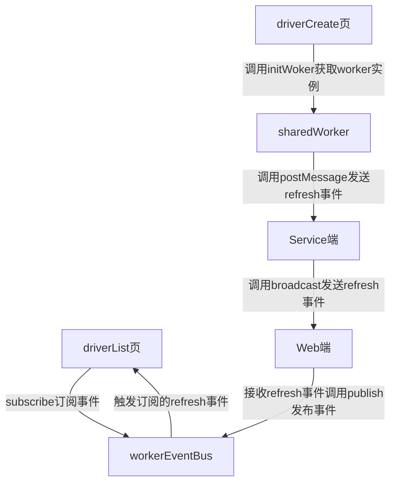

# sharedWorker使用指南

## service端

service端中使用`allPorts`存储所有页面的`port`

`heartbeatSet`中是一个存储心跳的结构当`web`端启动时开启一个2s的定时器，每隔2s向`heartbeatSet`中存储的`port`发送一个心跳包，每次收到一个心跳包时将该`port`从`heartbeatSet`中删除，当2s后没有收到`web`返回的心跳就关闭这个port

`broadcast`是用来广播消息给所有port的方法

`events`中包含了实现定义好的所有事件:

- `heartbeat`: 心跳事件
- `refresh`: 刷新事件

## web端

web端中使用`sharedWorker`存储当前页面的worker
> 全局单例的sharedWorker

`WorkerEvents`中存储了`web`端的：

- `workerEventBus`: 独属于worker的单例 eventbus
- `hash`: 当前页面worker的hash
- `Events`: 当前页面worker的事件

## refresh整个事件流转

假设是driverList和driverCreate



> 预览流程图插件
>名称: Markdown Preview Mermaid Support
>ID: bierner.markdown-mermaid
>说明: Adds Mermaid diagram and flowchart support to VS Code's builtin markdown preview
>版本: 1.20.0
>发布者: Matt Bierner
>VS Marketplace 链接: <https://marketplace.visualstudio.com/items?itemName=bierner.markdown-mermaid>

## 全局初始化启动

在main.js中初始化单例worker

```js
// main.js

// ...
import initWorker from './worker/web/initWorker';
// ...
initWorker()
```

## 示例

```html
<!-- driverList -->

<script setup>
import { onMounted } from 'vue'
import { workerEventBus } from '@/worker/web/WorkerEvents'

const stopSubscribe = workerEventBus.subscribe('refresh', (args) => {
  // refresh处理
})

onUnmounted(() => {
  // 取消订阅
  stopSubscribe()
})
</script>
```

```html
<!-- driverCreate -->

<script setup>
import SharedWorker from '@/worker/web/initWorker'

const sharedWorker = SharedWorker()

// ...
// 需要发送更新事件的时候发
sharedWorker.port.postMessage({
  method: 'refresh',
  args: {
    // 参数
    // 比如只想更新driverList，就多写点自定义的逻辑，比如多传一个参数，另一个页面收到之后看是不是跟他有关系
    page: 'driverList'
  }
})
</script>
```
